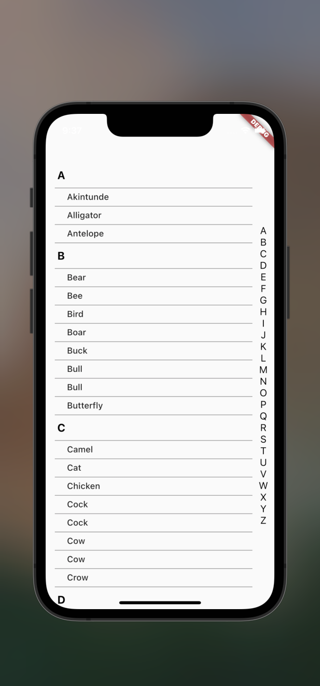

creating Ios Listview design.

this project is not done yet.

solved:

    1. accept data as list
    2. reorder the data if not sorted yet.
    3. convert the first letter on the item-list to upper-case
    4. create Main list header to update when sub-Header reach the position

 not solved yet:

        1. drag behaviour for the side alphabet
        2. Main header text change as scroll moves
        2. compare the design and finalize the design
        3. optimize the code

check screenshot inside project asset folder
    
