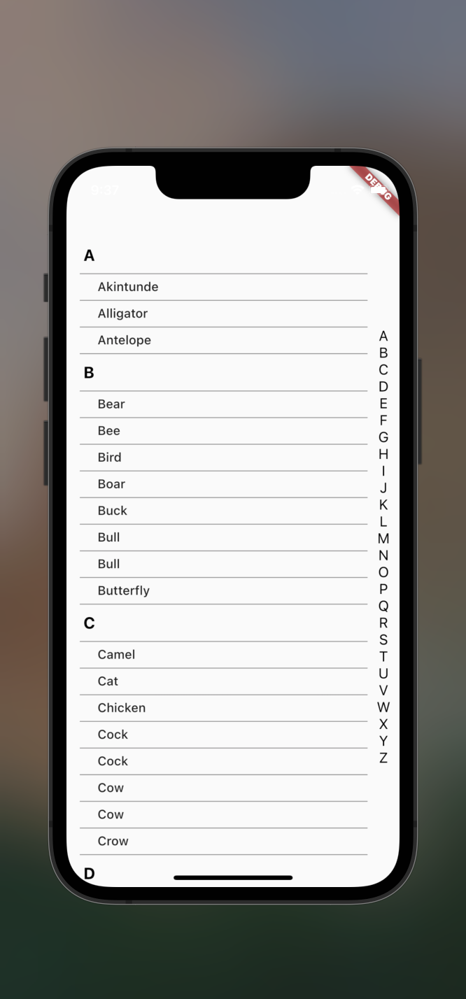

creating Ios Listview design.

this project is not done yet.

solved:

    1. accept data as list
    2. reorder the data if not sorted yet.
    3. convert the first letter on the item-list to upper-case
    
 not solved yet:
    1. create Main list header to update when sub-Header reach the position
    2. drag behaviour for the side alphabet
    3. compare the design and finalize the design
    4. optimize the code

check screenshot inside project asset folder
    
